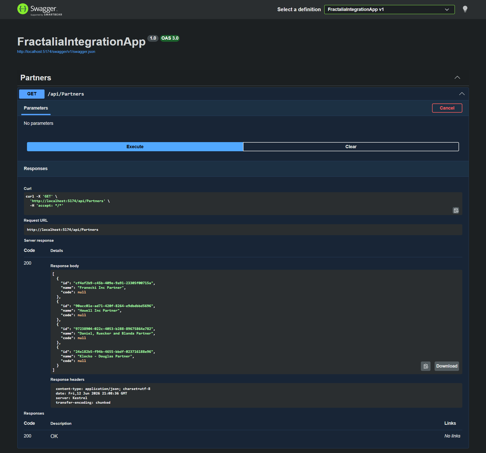

# Fractalia Integration API

Este proyecto es una Web API desarrollada en **.NET 10 / .NET Core** que actúa como un servicio integrador (Proxy/BFF) para consumir endpoints externos de forma automatizada y segura.

## Arquitectura y Buenas Prácticas Implementadas

- **Abstracción de Lógica:** Se implementó el patrón de diseño de servicios mediante `IFractaliaClient` para desacoplar el consumo HTTP de los controladores.
- **Gestión Eficiente de Conexiones:** Uso de `IHttpClientFactory` en `Program.cs` para el manejo óptimo del ciclo de vida de los sockets y configuración centralizada de la URL base.
- **Autenticación Automatizada:** El cliente HTTP gestiona de forma transparente el flujo de autenticación. Al realizar cualquier petición (ej. Partners), el sistema verifica la existencia del token JWT; si no existe, consume el endpoint de `/auth/login` en segundo plano, almacena el token en memoria y reanuda la petición original inyectando las credenciales correspondientes.
- **Seguridad de Datos:** Uso de Data Transfer Objects (DTOs) para el manejo de payloads, evitando la exposición directa de las entidades de dominio.

## Cómo Ejecutar el Proyecto

1. Clonar el repositorio.
2. Asegurar tener instalado el SDK de .NET correspondiente.
3. Ejecutar en la terminal desde la raíz del proyecto:
   ```bash
   dotnet build
   dotnet run

Abrir el navegador en la ruta local de Swagger para probar los endpoints expuestos de forma interactiva (ej. http://localhost:5174/swagger/index.html).

## Prueba de Funcionamiento (Prueba Local con Swagger)

Aquí se puede observar el resultado exitoso (200 OK) al consumir el endpoint `/api/Partners`, donde el sistema realiza la autenticación automática en segundo plano y mapea los datos correctamente:

